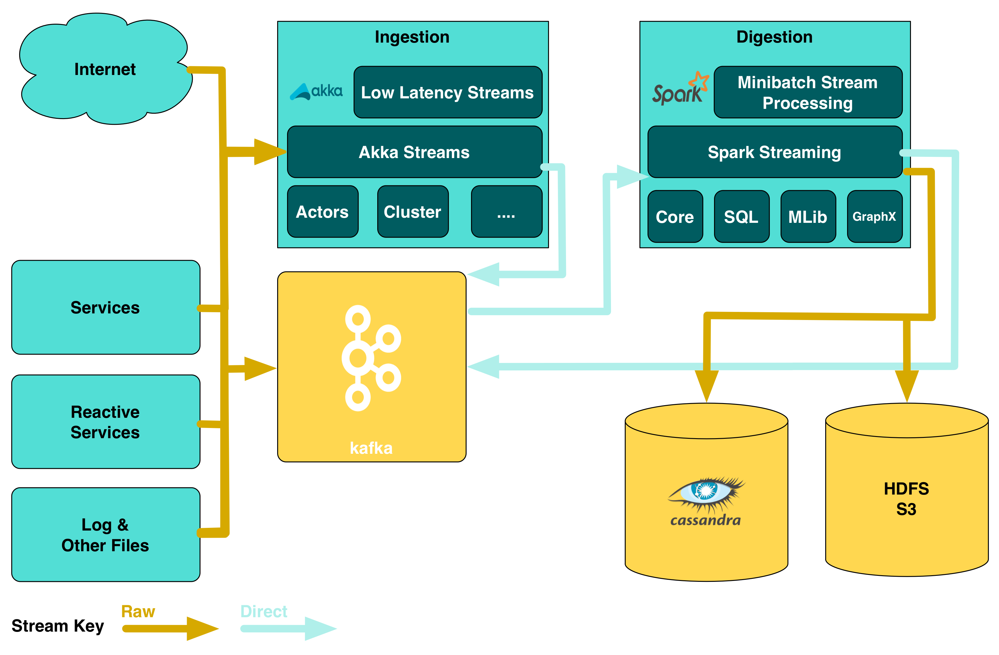
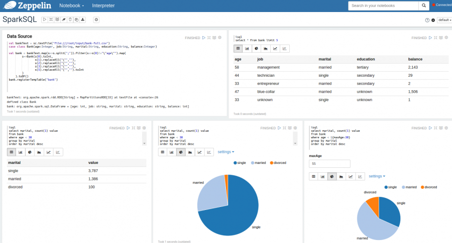
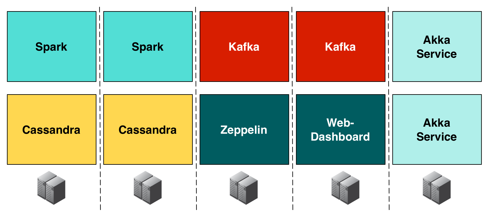
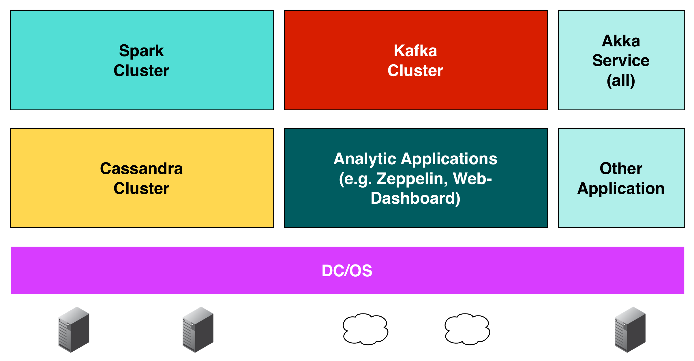

### SMACK

<!-- .slide: data-background="img/background-orange-orig.jpg" -->

- S park <!-- .element: class="fragment" --> 
- M esos <!-- .element: class="fragment" --> 
- A kka <!-- .element: class="fragment" --> 
- C assandra <!-- .element: class="fragment" --> 
- K afka <!-- .element: class="fragment" --> 

---

### Emerging Architecture 

<!-- .slide: data-background="img/background-green-orig.jpg" -->

---

### Zeppelin

<!-- .slide: data-background="img/background-green-orig.jpg" -->

---

### Benefits and downsides of Zeppelin

<!-- .slide: data-background="img/background-green-orig.jpg" -->

- &#x1f604; No Jar-Wars  <!-- .element: class="fragment" --> 
- &#x1f604; Easy analytics  <!-- .element: class="fragment" --> 
- &#x1f621; New technology  <!-- .element: class="fragment" --> 

---

### Traditional Approach

<!-- .slide: data-background="img/background-green-orig.jpg" -->

---

### DC/OS Approach

<!-- .slide: data-background="img/background-green-orig.jpg" -->

